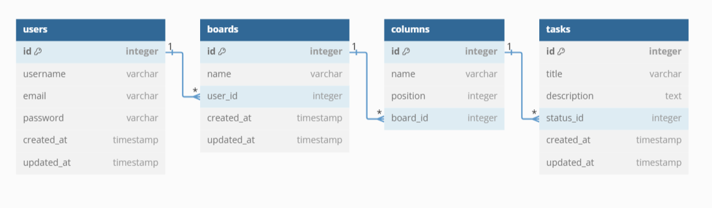

# Kanban System

## Descrição do Projeto

Este desafio proposto pela Field Control é um sistema de Kanban desenvolvido para gerenciar tarefas e projetos de forma visual e interativa. O projeto é dividido em:

1. **Frontend**: Desenvolvido com Angular (Typescript), fornece a interface de usuário para a criação e gestão de tarefas, quadros e colunas.
2. **Backend**: Desenvolvido com NestJS, gerencia a lógica do servidor, comunicação com o banco de dados MySQL e autenticação de usuários.

## Tecnologias Utilizadas

- **Frontend**: Angular
- **Backend**: NestJS
- **Banco de Dados**: MySQL

## Estrutura do Banco de Dados

O banco de dados utiliza as seguintes tabelas principais:

- **Users**: Armazena informações sobre os usuários do sistema.
- **Boards**: Armazena os quadros de Kanban criados pelos usuários.
- **Columns**: Armazena as colunas dentro dos quadros.
- **Tasks**: Armazena as tarefas associadas às colunas.



## Inicialização do Projeto

### Pré-requisitos

Certifique-se de ter os seguintes softwares instalados:

- [Node.js](https://nodejs.org/)
- [MySQL](https://www.mysql.com/)
- [Angular CLI](https://angular.io/cli)

### Inicialização local do Backend

1. **Acesse a pasta do backend** <br> `cd angular-kanban-backend`
2. **Inicialize o Mysql** <br> `sudo systemctl start mysql`
3. **Crie um arquivo .env no pasta angular-kanban-backend/**

```shell
   DB_HOST=localhost
   DB_PORT=3306
   DB_USERNAME=root
   DB_PASSWORD=sua_senha
   DB_DATABASE=kanban_db
```

4. **Inicialize o backend** <br> `npm run start:dev`
5. **Faca operações no enpoint** `http://localhost:3000/`

### Inicialização local do Frontend

1. **Acesse a pasta do frontend** <br> `cd angular-kanban-frontend`
2. **Inicialize o frontend** <br> `ng serve`
3. **Acesse o frontend na porta local** `http://localhost:4200/`
